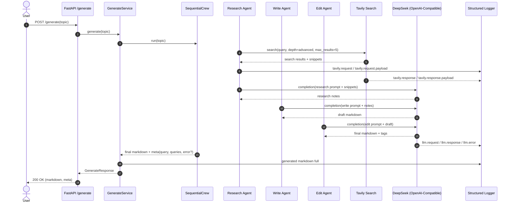

# DEV_NOTES.md --- agent-hot-note（三阶段实现版）

> 项目目标：分阶段实现 FastAPI + CrewAI + DeepSeek + Tavily 的可扩展 Agent 服务  
> 原则：先跑流程 -> 再接真实能力 -> 最后做工程优化

------------------------------------------------------------------------

# 当前状态（2026-02-20）

## ✅ 验收结论

- 阶段 2 已验收通过
- 当前主链路为真实能力：`Tavily -> CrewAI(research/write/edit) -> DeepSeek`
- 运行时已移除 Mock 逻辑与配置开关（无 `USE_MOCK`）

## ✅ 当前能力

- 接口：
  - `POST /generate`
  - `GET /healthz`
- 真实搜索：
  - `providers/search/tavily.py`
  - `search_depth=advanced`
  - `max_results=5`
- 真实 LLM：
  - `providers/llm/deepseek.py`
  - 通过 OpenAI 兼容方式接 DeepSeek
- 统一配置：
  - `config.py`（Pydantic Settings + `.env`）
- 错误兜底：
  - LLM 失败时返回结构化错误 `meta.error`
- 日志：
  - `tavily.request` / `tavily.request.payload`
  - `tavily.response` / `tavily.response.payload`
  - `llm.request` / `llm.response` / `llm.error`
  - 最终返回前端的 Markdown 全量日志

------------------------------------------------------------------------

# Phase 2（当前执行基线）

## 🎯 目标

接入真实 DeepSeek + Tavily，并保证可观测性和失败可恢复性。

## ✅ DoD（已达成）

- 配置 `.env` 后可真实生成内容
- 返回 `meta` 包含 `query` 和 `queries`
- 出错不崩溃（返回结构化错误）
- 日志可追踪 Tavily/LLM 输入输出与关键报文

## 关键配置

- `OPENAI_API_KEY`
- `OPENAI_BASE_URL=https://api.deepseek.com`
- `OPENAI_MODEL=deepseek-chat`
- `TAVILY_API_KEY`
- `LLM_TIMEOUT_SECONDS`
- `LLM_NUM_RETRIES`

------------------------------------------------------------------------

## Agent 与 LLM 交互图（Mermaid）



------------------------------------------------------------------------

# Phase 3（待推进）

## 3.1 Fallback 优化

- 目标：提升搜索质量与稳定性
- 计划：
  1. Tavily 域名定向检索（优先 `include_domains`，替代纯 `site:` query）
  2. 第一优先域名池（如 xiaohongshu）结果不足时，切换第二域名池（zhihu / bilibili）
  3. 仍不足时回退到通用 query（不带域名限制）
- 规则：
  - 结果数量 < 2 -> fallback
  - 摘要过短 -> fallback
  - 标题重复率高 -> fallback
  - 输出 `meta.fallback_queries` 与 `meta.fallback_domains`

## 3.1.1 单 URL 抓取增强（新增）

- 场景：已命中高价值 URL，需要更完整正文供写作阶段使用
- 计划：
  - 对候选 URL 做白名单筛选
  - 使用 Tavily Extract 获取正文
  - 失败时回退到 search snippets，不阻塞主流程
- 输出：
  - `meta.extracted_urls`
  - `meta.extract_failed_urls`

## 3.2 记忆机制（轻量版）

- Topic Memory：
  - `topic_hash -> 最终 Markdown + 要点`
- Pattern Memory：
  - 标题模板 / 钩子模板 / 结构模板
  - 来源：editor 修改清单自动提取
- 存储形式：`jsonl` 或 `sqlite`

## Phase 3 DoD

- fallback 自动触发且可解释
- 域名级 fallback 可观测（queries + domains）
- 单 URL 提取可选启用且失败可降级
- 同 topic 可命中缓存
- 输出稳定性更高（格式校验）

## Phase 3 PR 拆分计划

- PR-1：Fallback 基础骨架
  - 新增 `pipeline/fallback.py`
  - 定义 fallback 输出结构（queries/domains/reason/triggered）
  - 补单测（不接主流程）
- PR-2：域名池策略 + 质量判定（已完成）
  - 实现 `include_domains` 分层检索（primary -> secondary -> generic）
  - 实现触发规则（结果数/摘要长度/标题重复率）
  - 阈值配置化
- PR-3：主链路接入 + Meta 输出（已完成）
  - `SequentialCrew` 接入 fallback
  - `GenerateService` 输出 `meta.fallback_queries` / `meta.fallback_domains`
  - 保持 research/write/edit 任务结构不变
- PR-4：URL Extract 增强 + 降级（已完成）
  - 新增 Tavily Extract 方法
  - 白名单 URL 抽取正文
  - 失败回退到 snippets，补 `meta.extracted_urls` / `meta.extract_failed_urls`
- PR-5：可观测性与文档收尾
  - 增加 fallback/extract 关键日志
  - 更新 README 与 DEV_NOTES 验收项

------------------------------------------------------------------------

# 运行方式

```bash
uvicorn agent_hot_note.api.app:app --reload
```

------------------------------------------------------------------------

# 附录 A：Phase 1 历史记录（已归档）

> 以下内容为阶段 1 历史方案，不再作为当前执行基线。

- 阶段 1 目标：搭建骨架、跑通接口、无需真实 API Key
- 历史实现：
  - MockLLM：固定输出，模拟三阶段
  - MockSearch：固定 search results
- 当前状态：
  - 运行时 Mock 分支已移除
  - 仅保留真实 Tavily + DeepSeek 链路

------------------------------------------------------------------------

结束。
